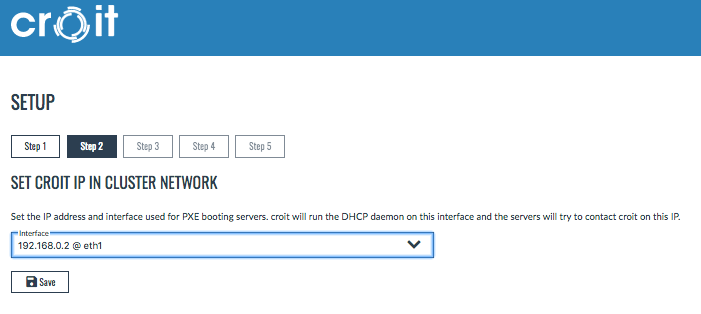
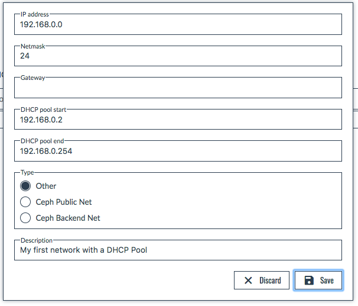
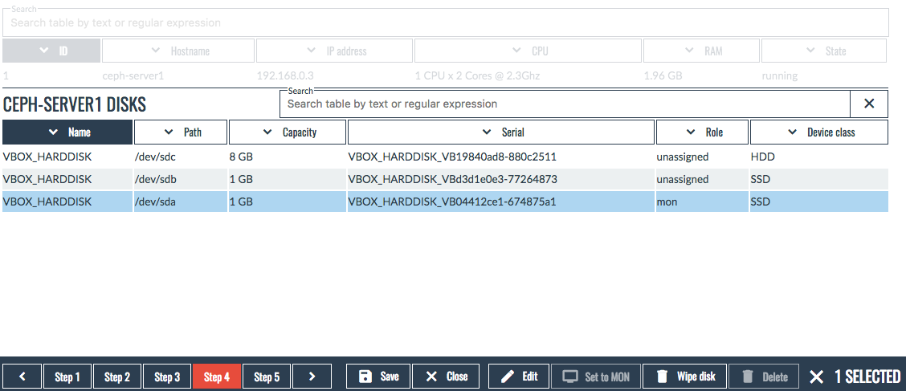
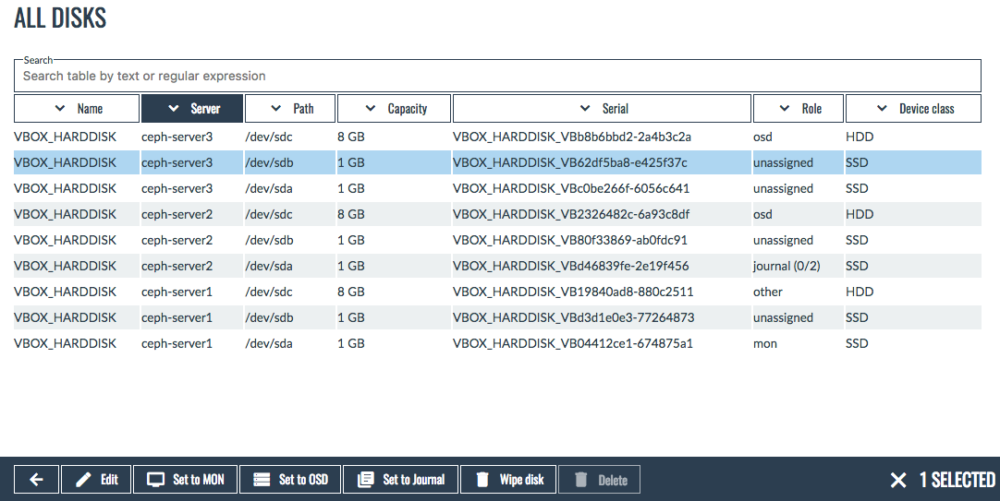
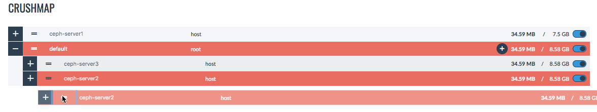
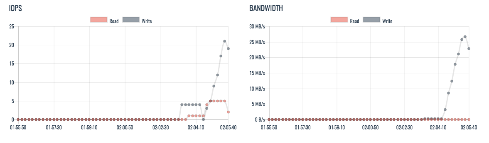
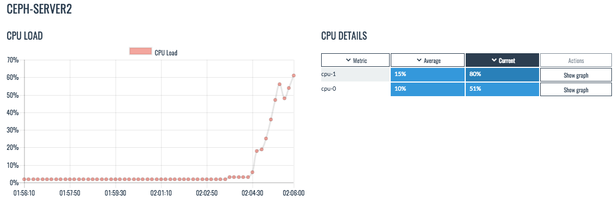

# CAUTION
This is a demo setup and not meant for production, check out our [guide for production setups](https://croit.io/production/) 
You can contact us at [croit.io](https://croit.io) or [info@croit.io](mailto:info@croit.io) if you encounter problems with this setup or need help getting it to production.

Be careful with deployments on laptops. Sleep mode of the laptop or pausing VMs can mess with clocks beyond repair. `vagrant ssh` followed by `sudo ntpdate` followed by a restart of affected VMs can help.

# Croit demo setup with Vagrant

The easiest way to try out croit is by using our Vagrant demo setup.

## Requirements
The following requirements must be met to run this demo:

* [Vagrant](https://www.vagrantup.com) 1.9.4 or newer 
* [VirtualBox](https://www.virtualbox.org/) 5.1.26 or newer
* At least 8 GB RAM
* At least 10 GB disk space, 40 GB or more if you want to fill up your cluster
* A reasonably fast Internet connection, the initial setup will download ~3 GB of data
* We recommend using a recent version of Chrome or Firefox

Note that PXE booting is an unusual scenario for both Vagrant and VirtualBox and may cause unexpected issues.
We have last tested these procedures with VirtualBox 5.0 and 5.1 and Vagrant 1.9.4 and 2.0.0 on macOS and Linux.

**Caution:**
The VirtualBox PXE stack sometimes hangs when a server reboots when running on macOS on some versions of VirtualBox.
Shut down Ceph VMs completely and restart them instead of resetting them if you encounter this problem.

The Vagrant plugin `vagrant-vbguest` might be required when running on Windows.
Run the following command if you encounter problems with the local port forwarding configuration.

```
vagrant plugin install vagrant-vbguest
```


## Installation
Installing the croit demo is as simple as running our Vagrant file:

```
git clone https://github.com/croit/vagrant-demo croit-vagrant
cd croit-vagrant
vagrant up
```

Note that this will take several minutes.
Don't worry if the output looks unresponsive while the Docker image (1.5 GB) is being downloaded.

croit is made available by the Vagrant environment at [http://localhost:8080](http://localhost:8080) or via https at [https://localhost:8443](https://localhost:8443) with a self-signed certificate.

### VMs in this setup
Our Vagrant file defines several VMs: `croit` and `ceph1` to `ceph5`.
`croit` is the main VM running the croit management engine, the `ceph` VMs are all configured identically, each featuring three disks to be used as mon, osd, and journal.
The Ceph VMs are started later once croit is configured.

## Setting up croit

croit will guide you through the initial setup of your Ceph cluster.
The main control panel is located at the bottom of the screen and shows the progress through the setup and action buttons.

### Login
Login as `admin` with password `admin`. The first step allows you to change your password to something more secure.

### Setup management interface
croit uses one network interface as management interface for all management communication from PXE boot to monitoring running servers.

This demo setup preconfigures an interface with the IP address `192.168.0.2/24` in the croit VM, we will use this as our management interface.
The interface should be named `eth1`, but the name might change.



### Setup PXE network

This demo setup only features a single network that is used for management, PXE, and Ceph traffic alike.
Create a new setup and configure it as `192.168.0.0/24` with a DHCP pool for the initial boot of new servers.



We recommend using multiple networks for a real setup, but a single network for all traffic is sufficient for this demo.
Click save to continue to the next step.


### Boot the first server
We now have everything we need to boot our first server.
Run the following Vagrant command to boot the first VM.

```
vagrant up ceph1
```


**Caution:**
The live image is downloaded asynchronously from croit.io after the first start, the menu will instruct you to wait and retry if the download is not yet finished.


The server will automatically boot our live image and it will show up in our frontend as soon as you see the boot menu.

Rename the server to something reasonable like `ceph-server1` using the Edit button.
Disks and NICs will show up a few seconds after the server finishes booting.
Configure one of the 1 GB disks as Ceph mon.
Mon disks are used to store the Ceph monitor database, each server running a Ceph monitor service needs one disk configured as mon disk.



This formats and mounts the disk on the server, the Save button leading to the next step becomes active once this action completes successfully.


**Caution:**
Vagrant doesn't know about our network and login configuration, it will hence get stuck with the following message:


```
Warning: Authentication failure. Retrying...
```

It is safe to cancel Vagrant with `ctrl-c` as soon as you see this message.
The VM will continue to run even though Vagrant complains.

### Create the cluster
The last step is creating the Ceph cluster.
Each server that was configured in the previous step can be selected as a mon.

**Caution:**
A Ceph monitor has exactly one IP address (even if the server has multiple IPs).
This IP needs to be reachable by all Ceph services, clients, and the croit management daemon.

This demo setup only has a single network, making this an easy choice.
You will have to create your designated public network during setup if you are using segregated storage and management networks in a real setup.


## Adding OSDs
Our cluster starts out in a bad state as we haven't created any OSDs yet.
Let's get started by booting the remaining two VMs.

```
vagrant up ceph2
vagrant up ceph3
```

The servers will show up in the 'Hardware' tab where they can be renamed with the 'Edit' action.

Create OSDs on all three servers.
The 'All Disks' button shows a convenient overview of all disks in all servers.
You can configure one of the smaller disks as journal disk to test external journal partitions.



## Add hosts to the crush map
croit does not automatically add new hosts to the crush map to avoid data movement before a server is fully configured.
Select the CRUSH map tab and add the servers to the default root via drag and drop by dragging them at the drag indicator icon (=).
Click 'Save changes' to update the crush map.



You can also add CRUSH buckets here to create complex hierarchies.

## (Optional) Adding mons
Configure a disk as mon, then select 'Show services' to create an additional Ceph monitor service.

Keep in mind that there should be an odd number of mons for optimal fault tolerance.

**Caution: ** New installations with Luminous sometimes run into a Ceph bug when initially adding mons that leads to all mons except the first one restarting very often. We are currently investigating the cause for this.
A simultaneous restart of all mon and mgr sevices fixes it and the issue only occurs once per installation (if it occurs).

## Test the cluster with RBD

Your cluster is now ready to be used. The health should show up as "Ok" in the status view after a few seconds.
Let's test it by mounting and using a disk image.

### Creating an RBD image

You can create an RBD image from the 'Pools' tab, select 'Show RBDs' on the default rbd pool. Create an RBD image with KRBD compatibility enabled, this allows us to mount and use the image directly from Linux.


### Configure a Ceph client

We will use the croit mangement VM as test client for simplicity here.

The 'Keys' tab allows downloading Ceph keyrings and a slimmed-down `ceph.conf` for Ceph clients. Use the `client.admin` keyring.

All downloads offered by croit can either be downloaded directly or as a copy-pastable link that is valid for 30 minutes.


```
vagrant ssh # connects to the croit management VM
sudo curl -k -o /etc/ceph/ceph.client.admin.keyring http://localhost:8080/api/download/XXXXX/ceph.client.admin.keyring
sudo curl -k -o /etc/ceph/ceph.conf http://localhost:8080/api/download/XXXXX/ceph.conf
```

**Caution:**
The link contains a unique token, copy it from the croit frontend and not from the textbox above.

**Caution:**
Vagrant translates ports, this might break the generated link.
The correct ports to use inside the VM are 8080 for HTTP and the default port (443) for HTTPS.

Test the configuration by running `ceph status`.

### Mount and use the rbd

Run the following inside the VM to mount and use the RBD.

```
sudo rbd map rbd/test-image # change image name if necessary
sudo mkfs.xfs /dev/rbd0
mkdir rbd-test
sudo mount /dev/rbd0 rbd-test
cd rbd-test
sudo dd if=/dev/zero of=./testfile bs=4M count=250
```


### Observe Statistics

You can use the statistics tab to observe IO and drill down to detailed performance statistics of individual servers.





All of this data is stored in graphite.
This allows you feed this data into your existing monitoring systems such as icinga2 or Grafana.

## Test the cluster with other protocols
Other things to try:

* CephFS by adding a metadata server
* Our highly available NFS server that makes CephFS available to legacy clients
* RadosGW instances to try out the S3 API
